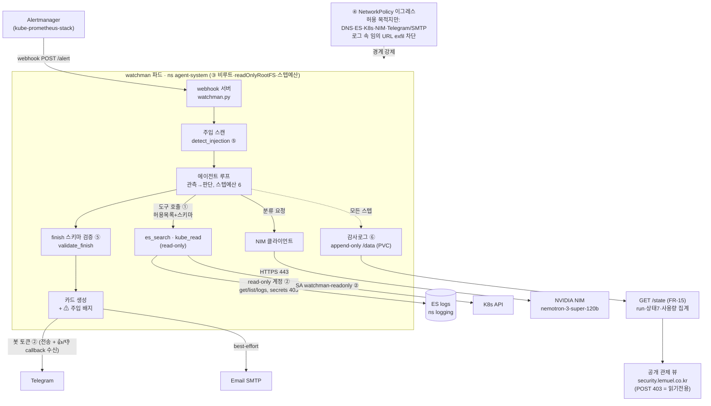

# Watchman 아키텍처

> Alertmanager 알림 → in-cluster 에이전트가 read-only 조사 → NIM 분류 → 제안 카드.
> 자동 실행 없음. 전 스텝 감사 기록. 보안 통제 6축이 경계마다 걸려 있다.

## 데이터 흐름 + 통제 경계

## 통제 6축이 걸리는 위치

| 축 | 통제 | 다이어그램 상 위치 |
|---|---|---|
| ① | 도구 허용목록 + 스키마 | `LOOP → TOOLS` 간선, 인자 검증 |
| ② | 최소 권한 자격증명 | `TOOLS → ES/K8S`, `CARD → TG` (read-only·전송전용) |
| ③ | 격리 실행 | `POD` 서브그래프(비루트·readOnlyRootFS·스텝예산) |
| ④ | 이그레스 통제 | `NETPOL` 경계 — 파드 밖으로 나가는 모든 간선 |
| ⑤ | 주입 방어 | `SCAN`(⚠ 배지) + `VALID`(스키마 밖 폐기) |
| ⑥ | 감사 + 승인 게이트 | `AUDIT`(전 스텝) — 실행 간선이 **없다**(제안만) |

## 위협 모델 한 줄

최대 공격면은 **ES 로그 내용**(간접 프롬프트 주입)이다. 방어는 ⑤(무력화 시도) +
①④(성공해도 할 수 있는 게 없음 — 도구가 read-only, 이그레스 봉쇄) + ⑥(했다면 남는다)의 다층.

## 조사 시퀀스

세부 시퀀스는 [../SEQUENCE-DIAGRAM.md](../SEQUENCE-DIAGRAM.md) 참조.
